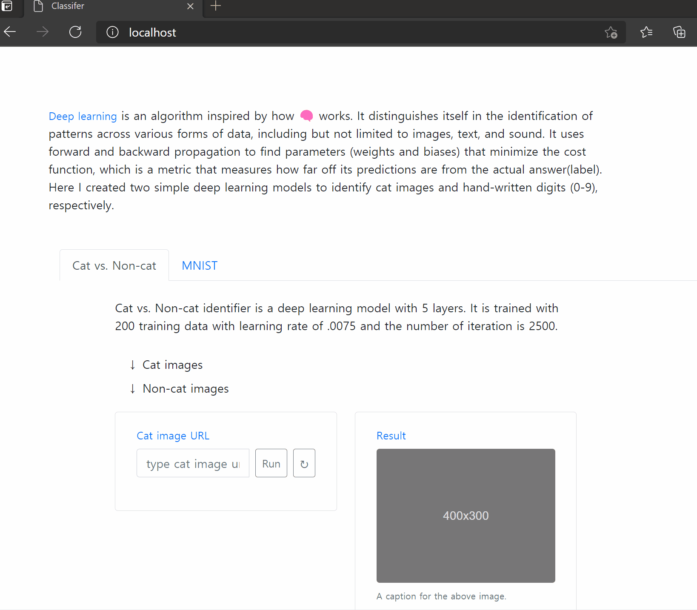
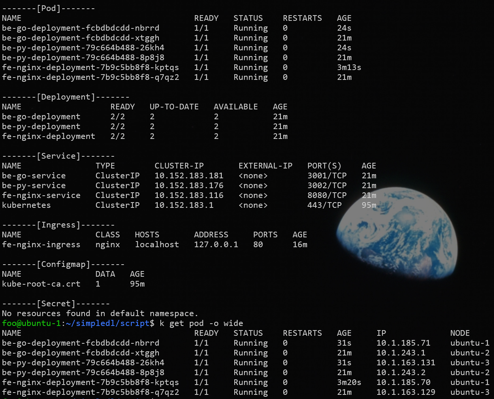
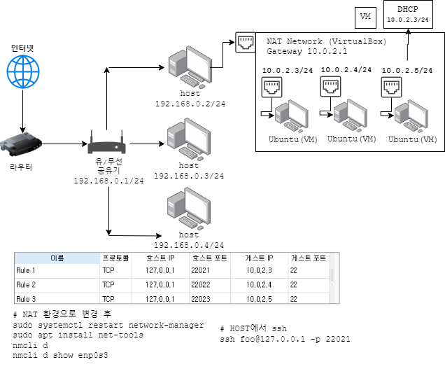
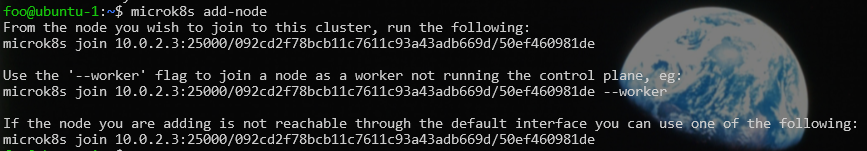
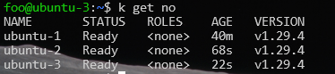
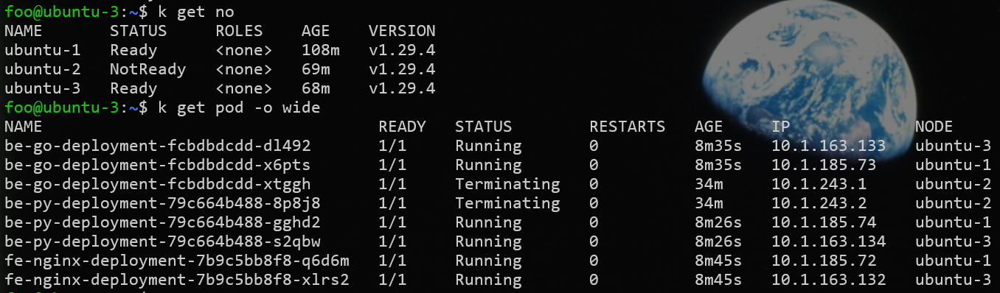

# Simple Kubernetes app


### Image recognizer app

I created a web app using basic [deep learning](#https://en.wikipedia.org/wiki/Deep_learning) algoirithm for a backend service, and [kubernetes](#https://kubernetes.io/) for [microservices](#https://en.wikipedia.org/wiki/Microservices) architecture. My goal is to make it perform binary classification on cat vs. non-cat images from a given image url.






My simple application is a basic deep learning image recognizers, one of which was covered in Andrew Ng's coursera course. I created two simple deep learning models to identify cat images and hand-written digits (0-9), respectively.

### Skills I used

- Kubernetes : 3-master node cluster w/ `microk8s`
  - also `docker-compose` implementation for initial testing
- Docker (build images using Dockerfiles for each serice)
- Microservices architecture
  - Frontend: Nginx (includes static files html,css,js)
  - Backend: Python, Golang web server
- TODO: Deep learning algorithm (with basic numpy) for binary classification (cat/non-cat recognizer) **(50% in progress)**
  - The algorithm includes basic forward and [backward propagation](#https://en.wikipedia.org/wiki/Backpropagation) using numpy to calculate mathematic operations. 
- Virtualbox (cli) to create 3 master nodes (ubuntu) for k8s cluster

<!--6. TODO: Hetzner plus minikube nginx hello world in go Plus tail scale funnel
 - https://tailscale.com/kb/1223/funnel
  - tailscale exit node VPN
  -->

### Virtualbox network architecture

Before doing anything I was planned to do, I had to construct an environment in which my application will be deployed. I considered virtualbox, cloud(GCP, AWS). Here, I implemented local virtualbox environment. In the furture I will try out GCP, AWS implemntation. 🔥




- Hosts: 10.0.2.3, 10.0.2.4, 10.0.2.5
- OS: Ubuntu 24.04 server

```bat
VBoxManage natnetwork add --netname k8snetwork --network "10.0.2.0/24" --enable --dhcp on
VBoxManage dhcpserver add --netname k8snetwork --server-ip "10.0.2.2" --netmask "255.255.255.0" --lower-ip "10.0.2.3" --upper-ip "10.0.2.254" --enable

vboxmanage dhcpserver restart --network=k8snetwork

for /L %%i in (1, 1, 3) do (
  REM Create VM
  VBoxManage createvm --name ubuntu-%%i --register --ostype Ubuntu_64
  REM ...
  REM ...
)

REM Set up port forwarding rules
VBoxManage natnetwork modify --netname k8snetwork --port-forward-4 "Rule 1:tcp:[127.0.0.1]:22021:[10.0.2.3]:22"
VBoxManage natnetwork modify --netname k8snetwork --port-forward-4 "Rule 2:tcp:[127.0.0.1]:22022:[10.0.2.4]:22"
VBoxManage natnetwork modify --netname k8snetwork --port-forward-4 "Rule 3:tcp:[127.0.0.1]:22023:[10.0.2.5]:22"

REM application port
VBoxManage natnetwork modify --netname k8snetwork --port-forward-4 "Http:tcp:[127.0.0.1]:80:[10.0.2.3]:80"
```


### Microservices

1. frontend: nginx (nodejs vite in local) + javascript + html + css
2. backend/web: golang (gin framework)
3. backend/worker: python (fast api, numpy, scikit-learn)
  - https://fastapi.tiangolo.com/tutorial/


### Communication between services

1. **HTTP/REST API**: You can expose a REST API on your Python backend and have the Golang server make HTTP requests to it. This is similar to how your JavaScript frontend communicates with the Golang server

2. **gRPC/Protobuf**: gRPC is a high-performance, open-source universal RPC framework, and Protobuf (short for Protocol Buffers) is a method for serializing structured data. You can use gRPC and Protobuf for communication between your Golang and Python applications. This method is efficient and type-safe, but it might be a bit more complex to set up compared to a REST API.

3. **Message Queue**: If your use case involves asynchronous processing or you want to decouple your Golang and Python applications, you can use a message queue like RabbitMQ or Apache Kafka. In this setup, your Golang application would publish messages to the queue, and your Python application would consume these messages.

4. **Socket Programming**: You can use sockets for communication if both your Golang and Python applications are running on the same network. This method requires a good understanding of network programming.

5. **Database**: If both applications have access to a shared database, you can use the database as a communication medium. One application writes to the database, and the other one reads from it.


- [CORS issue](#https://developer.mozilla.org/en-US/docs/Web/HTTP/CORS)

When a web application tries to make a request to a server that’s on a different domain, protocol, or port, it encounters a CORS (Cross-Origin Resource Sharing) issue. Add headers to backend server accordingly

```
For security reasons, browsers restrict cross-origin HTTP requests initiated from scripts.
For example, fetch() and XMLHttpRequest follow the same-origin policy.

This means that a web application using those APIs can only request resources
from the same origin the application was loaded from unless the response
from other origins includes the right CORS headers.

=> Add appropriate headers in golang server.
```


### Backend - Golang web server


```sh
cd simpledl/backend/web

go mod init github.com/jnuho/simpledl/backend/web

# download library dependencies specified in main.go
go mod tidy
```

### Backend - Python web server

- Use FastAPI + Unicorn
  - FastAPI is an ASGI (<b>Asynchronous</b> Server Gateway Interface) framework which requires an ASGI server to run.
  - Unicorn is a lightning-fast ASGI server implementation

- install python (download .exe from python.org)
  - check Add to PATH option (required)


- Run the python web server

```sh
uvicorn main:app --port 3002
```


#### Mathematical background for deep learning image recognizer

The basic operations for forward and backward propagations in deep learning algorithm are as follows:

- Forward propagation for layer $l$: $a^{[l-1]}\rightarrow a^{[l]}, z^{[l]}, w^{[l]}, b^{[l]}$

  $Z^{[l]} = W^{[l]} A^{[l-1]} + b^{[l]}$

  $A^{[l]} = g^{[l]} (Z^{[l]})$

  (for $i=1,\dots,L$ with initial value $A^{[0]} = X$)

<br>

- Backward propagation for layer $l$: $da^{[l]} \rightarrow da^{[l-1]},dW^{[l]}, db^{[l]}$

  $dZ^{[l]} = dA^{[l]} * {g^{[l]}}^{'}(Z^{[l]})$

  $dW^{[l]} = \frac{1}{m}dZ^{[l]}{A^{[l-1]}}^T$

  $db^{[l]} = \frac{1}{m}np.sum(dZ^{[l]}, axis=1, keepdims=True)$

  $dA^{[l-1]} = {W^{[l]}}^T dZ^{[l]} = \frac{dJ}{dA^{[l-1]}} = \frac{dZ^{[l]}}{dA^{[l-1]}} \frac{dJ}{dZ^{[l]}} = \frac{dZ^{[l]}}{dA^{[l-1]}} dZ^{[l]}$

  (with initial value $dZ^{[L]} = A^{[L]}-Y$)


### Frontend - local setup

- Download  & install nodejs 20.12.2
  - for local development using `vite`

```sh
npm create vite@latest
  ? Project name: lesson11
  > choose Vanilla, TypeScript
```

- Edit `package.json` to edit port and dependencies

```json
  "scripts": {
    "dev": "vite --host 0.0.0.0 --port 8080",
    "build": "tsc && vite build",
    "preview": "vite preview"
  },

  "dependencies": {
    "axios": "^1.6.8"
  }
```

Note that I will be using nginx instead in production environment. I used nodejs vite just for local development environment.

```sh
# install dependencies specified in package.json
# install if package.json changes e.g. project name
npm i
npm run dev
  VITE v5.2.9  ready in 180 ms

  ➜  Local:   http://localhost:4200/
  ➜  Network: use --host to expose
  ➜  press h + enter to show help
```

- Edit code
  - Write `index.html`
  - Create directory: `./model`, `./templates`
  - Define models and templates
  - Edit `main.ts`


## Dockerize

**NOTE**: It is crucial to optimize Docker images to be as compact as possible.
One strategy to achieve this is by utilizing base images that are minimalistic, such as the Alpine image.

- [NOTE on defining backend endpoint in frontend](https://stackoverflow.com/a/56375180/23876187)
  - frontend app is not in any container, but the javascript is served from container as a js script file to <b>your browser</b>!

- frontend nginx service


### Minikube implementation

To set up your Nginx, Golang, and Python microservices on Minikube, you'll need to create Kubernetes Deployment and Service YAML files for each of your microservices. You'll also need to set up an Ingress controller to expose your services to the public. Here's a high-level overview of the steps:

1. **Install Minikube**: If you haven't already, you'll need to install Minikube on your machine. Minikube is a tool that lets you run Kubernetes locally.

- ubuntu 24.04 install minikube

```sh
curl -LO https://storage.googleapis.com/minikube/releases/latest/minikube_latest_amd64.deb
sudo dpkg -i minikube_latest_amd64.deb

# unintstall
#sudo dpkg -r minikube
```

2. **Start Minikube**: Once installed, you can start a local Kubernetes cluster with the command `minikube start`.

```sh
# As a TROUBLE SHOOTING:
docker context use default
  default
  Current context is now "default"

minikube start
```

3. **Create secret**

3-1. Login to docker hub

```
docker login --username YOUR_USERNAME
```

3-2. Create secret

```
k create secret docker-registry regcred \
  --docker-server=https://index.docker.io/v1/ \
  --docker-username=USER \
  --docker-password=PW \
  --docker-email=EMAIL

k get secret
```


4. **Create Deployment and Service YAML Files**: For each of your microservices (Nginx, Golang, Python), you'll need to create a Deployment and a Service. The Deployment defines your application and the Docker image it uses, while the Service defines how your application is exposed to the network

4-1. deployment.yaml

```yaml
apiVersion: apps/v1
kind: Deployment
metadata:
  name: fe-nginx-deployment
spec:
  replicas: 1
  # Deployement manages pods with label 'app: fe-nginx
  selector:
    matchLabels:
      app: fe-nginx
  # define labels for the Pods:
  #   must be matched by service.yaml > spec.selector
  template:
    metadata:
      labels:
        app: fe-nginx
    spec:
      containers:
      - name: fe-nginx
        image: jnuho/fe-nginx:latest
        ports:
        - containerPort: 80
      imagePullSecrets:
      - name: regcred

```

4-2. service.yaml

```yaml
apiVersion: v1
kind: Service
metadata:
  name: fe-nginx-service
  namespace: simple
spec:
  # must match deployment.yaml > spec.template.metadata.labels
  selector:
    app: fe-nginx
  ports:
    - protocol: TCP
      port: 8080
      targetPort: 80
  type: ClusterIP
```


5. **Apply the YAML Files**: Once you've created your YAML files, you can apply them to your Kubernetes cluster with the command `kubectl apply -f <filename.yaml>`.


6. **Enable Ingress Controller**:

6-1. NGINX ingress controller using Minikube addons: you can use the command `minikube addons enable ingress`

```sh
minikube addons enable ingress
```

6-2. Nginx ingress controller

- [setting up an NGINX ingress controller](#https://medium.com/@amirhosseineidy/how-to-set-up-nginx-ingress-controller-in-local-server-6cc4bd7d6a6b) in a bare metal or local server:


Ingress is an API in Kubernetes that routes traffic to different services, making applications accessible to clients from the Kubernetes cluster. Among multiple choices like HAProxy or Envoy for setting up an ingress controller, NGINX is the most popular one. It is powered by the NGINX web server and is a fast and secure controller that delivers your applications to the clients easily.

- Install NGINX ingress controller with `helm`

```sh
# inside cmd or powershell
winget install Helm.Helm

# RESTART terminal and do:
helm upgrade --install ingress-nginx ingress-nginx \
  --repo https://kubernetes.github.io/ingress-nginx \
  --namespace ingress-nginx --create-namespace
```

- Check if ingress controller is working:

```sh
helm list
  NAME            NAMESPACE       REVISION        UPDATED                                 STATUS          CHART                   APP VERSION
  ingress-nginx   default         1               2024-04-30 14:26:18.9350713 +0900 KST   deployed        ingress-nginx-4.10.1    1.10.1

k get ClusterRole | grep ingress
  ingress-nginx                                                          2024-04-30T07:01:05Z

k get all
  NAME                                           READY   STATUS    RESTARTS   AGE
  pod/ingress-nginx-controller-cf668668c-zvkd9   1/1     Running   0          44s

  NAME                                         TYPE           CLUSTER-IP       EXTERNAL-IP   PORT(S)                      AGE
  service/ingress-nginx-controller             LoadBalancer   10.100.168.236   <pending>     80:32020/TCP,443:31346/TCP   44s
  service/ingress-nginx-controller-admission   ClusterIP      10.107.208.79    <none>        443/TCP                      44s
  service/kubernetes                           ClusterIP      10.96.0.1        <none>        443/TCP                      4m8s

  NAME                                       READY   UP-TO-DATE   AVAILABLE   AGE
  deployment.apps/ingress-nginx-controller   1/1     1            1           44s

  NAME                                                 DESIRED   CURRENT   READY   AGE
  replicaset.apps/ingress-nginx-controller-cf668668c   1         1         1       44s
```


7. **Create an Ingress YAML File**: The Ingress YAML file will define the rules for routing external traffic to your services. You'll need to specify the host and path for each service, and the service that should handle traffic to each host/path

8. **Apply the Ingress YAML File**: Just like with the Deployment and Service files, you can apply the Ingress file with `kubectl apply -f <ingress-filename.yaml>`.

- Ingress rules
  - Ingress rules are resources that help route services to your desired domain name or prefix. They are divided into prefix and DNS.
  - .yaml mainifest for ingress rules

```sh
k apply ingress.yaml
k get ingress
  NAME               CLASS   HOSTS                ADDRESS        PORTS   AGE
  fe-nginx-ingress   nginx   my-app.example.com   192.168.49.2   80      4m35s
```


9. **Access Your Services**: With the Ingress set up, you should be able to access your services from outside your Kubernetes cluster. You can get the IP address of your Minikube cluster with the command `minikube ip`, and then access your services at that IP


- Accessing application
  - For accessing these applications in a local cluster, you should access it through node port (30000 ports) or use a reverse proxy to send them.
  - But is there any way to access app on port 80 or 443?
    - use Port-forward or `MetalLB` to allow access to app on port 80 or 443.

- port forward

```sh
k get svc -n ingress-nginx
NAME                                 TYPE        CLUSTER-IP     EXTERNAL-IP   PORT(S)                      AGE
ingress-nginx-controller             NodePort    10.107.26.28   <none>        80:32361/TCP,443:31064/TCP   3h9m
ingress-nginx-controller-admission   ClusterIP   10.106.14.66   <none>        443/TCP                      3h9m

kubectl port-forward -n <namespace> svc/<service-name> <local-port>:<service-port>
kubectl port-forward -n ingress-nginx svc/ingress-nginx-controller 80:80 3001:3001 3002:3002

```

- Installing Metallb

```sh
# strictARP to true
kubectl edit configmap -n kube-system kube-proxy

  apiVersion: kubeproxy.config.k8s.io/v1alpha1
  kind: KubeProxyConfiguration
  mode: "ipvs"
  ipvs:
    strictARP: true

kubectl apply -f https://raw.githubusercontent.com/metallb/metallb/v0.13.10/config/manifests/metallb-frr.yaml

kubectl get pods -n metallb-system
  NAME                          READY   STATUS    RESTARTS   AGE
  controller-596589985b-jrnmk   1/1     Running   0          34m
  speaker-hdrmc                 4/4     Running   0          34m
```

- Now set a range IPs for your local load balancer by creating a configMap. 
  - Remember that the set of IP addresses you apply must be in the same range as your nodes IPs

The range of IP addresses you choose for MetalLB should be in the same subnet as your nodes' IPs. These IP addresses are used by MetalLB to assign to services of type LoadBalancer.
Using command, `k get node -o wide`, the INTERNAL-IP of my node is 192.168.49.2. So, choose a range of IP addresses in the 192.168.49.x range for MetalLB. For example, 192.168.49.100-192.168.49.110 as my range.

The IP addresses you choose for MetalLB should be reserved for MetalLB's use and should not conflict with any other devices on your network.

```yaml
# to see ip range for node
kubectl get nodes -o wide
  NAME       STATUS   ROLES           AGE   VERSION   INTERNAL-IP    EXTERNAL-IP   OS-IMAGE             KERNEL-VERSION                       CONTAINER-RUNTIME
  minikube   Ready    control-plane   41m   v1.30.0   192.168.49.2   <none>        Ubuntu 22.04.4 LTS   5.15.146.1-microsoft-standard-WSL2   docker://26.0.1

cat > configmap.yaml
apiVersion: metallb.io/v1beta1
kind: IPAddressPool
metadata:
  name: nat
  namespace: metallb-system
spec:
  addresses:
    - 192.168.49.100-192.168.49.110
---
apiVersion: metallb.io/v1beta1
kind: L2Advertisement
metadata:
  name: empty
  namespace: metallb-system


k apply -f configmap.yaml

kubectl rollout restart deployment controller -n metallb-system

# check EXTERNAL-IP for nginx-controller is assigned!!!
# the external IPS is assigned to your NGINX load balancer service and all other load balancer typed services.
k get svc
  NAME                                 TYPE           CLUSTER-IP       EXTERNAL-IP      PORT(S)                      AGE
  ingress-nginx-controller             LoadBalancer   10.100.168.236   192.168.49.100   80:32020/TCP,443:31346/TCP   68m
```

- DNS Setup
  - Finally, you need to set the domain names defined in the ingress rules in your DNS server or hosts file
  - edit hosts file, `C:\Windows\System32\drivers\etc\hosts`

```
192.168.49.100 my-app.example.com
```


### Using Minikube for image build and local development

- https://www.youtube.com/watch?v=_1uWY1GdDVY&ab_channel=GoogleOpenSource


```sh
minikube docker-env
    W0502 10:17:02.728250   12636 main.go:291] Unable to resolve the current Docker CLI context "default": context "default": context not found: open C:\Users\user\.docker\contexts\meta\37a8eec1ce19687d132fe29051dca629d164e2c4958ba141d5f4133a33f0688f\meta.json: The system cannot find the path specified.
    export DOCKER_TLS_VERIFY="1"
    export DOCKER_HOST="tcp://127.0.0.1:57853"
    export DOCKER_CERT_PATH="C:\Users\user\.minikube\certs"
    export MINIKUBE_ACTIVE_DOCKERD="minikube"

# To point your shell to minikube's docker-daemon, run:
# eval $(minikube -p minikube docker-env)


# Now your PC directs to minikube's docker
# From now, Any image you build will be directory on built on minikube's docker

# list images inside minikube cluster
docker images -a

cd dockerfiles
docker build -f dockerfiles/Dockerfile-nginx -t fe-nginx .

```

- deployment.yaml

```yaml
spec:
  templates:
    spec:
      containers:
      - name: fe-nginx
        image: fe-nginx:latest
        ports:
        - containerPort: 80
```

```sh
k apply -f deployment.yaml
```

- suppose source changed -> change image

```sh
docker rmi fe-nginx:latest
docker build -f dockerfiles/Dockerfile-nginx -t fe-nginx .
k delete -f deployment.yaml
k apply -f deployment.yaml
```

- mount data to minikube cluster
  - suppose golang docker container source does:


```go
var version = "0.0.2"
func indexHandler(w http.ResponseWriter, req *http.Request){ 
    // after deployment.yaml volumeMount, this will printout
    // NOTE:
    localFile, err := os.ReadFile("/tmp/data/hello-world.txt")
    if err != nil {
        fmt.Printf("couldn't read file %v\n", err)
    }
    // before deployment.yaml volumeMount, this will printout
    fmt.FPrintf(w,"<h1>hello world :) </h1> \n Version %s\n File Content:%s", version, localFile)
}
```


```sh
minikube mount  {localdir}:{minikube hostdir}

# mount a volume to minikube cluster (persistant storage)
# mount files to minikube cluster
minikube mount  /c/Users/user/Downloads/tmp:/tmp/data
```

```yaml
spec:
  templates:
    spec:
      containers:
      - name: fe-nginx
        image: fe-nginx:latest
        ports:
        - containerPort: 80
        # target dir inside pod: /tmp/data
        volumeMounts:
        - mountPath: /tmp/data
          name: test-volume
      volumes:
        - name: test-volume
          # host is kubernetes host(vm)
          hostPath:
            # directory location on host
            path: /tmp/data
```

- apply the changes:

```sh
docker rmi fe-nginx:latest
docker build -f dockerfiles/Dockerfile-nginx -t fe-nginx .
k delete -f deployment.yaml
k apply -f deployment.yaml

# deploy the app
minikube service my-fe-nginx
```

- now edit local hello-world.txt file
- then refresh browser to check the change is immediately applied


### GCP test

- create ubuntu vm
- ip restriction
- install google cloud sdk and init


```sh
gcloud compute security-policies create my-security-policy
gcloud compute security-policies rules create 1000 \
  --security-policy my-security-policy \
  --action allow \
  --src-ip-ranges <your-home-ip>
gcloud compute security-policies rules create 2000 
  --security-policy my-security-policy \
  --action deny \
  --src-ip-ranges 0.0.0.0/0
gcloud compute backend-services update <your-backend-service> \
  --security-policy my-security-policy
```

- dashboard

```sh
minikube ip
minikube dashboard --url
    http://127.0.0.1:45583/api/v1/namespaces/kubernetes-dashboard/services/http:kubernetes-dashboard:/proxy/
```

- minikube ingress

https://stackoverflow.com/a/73735009

```sh
minikube start
minikube addons enable ingress
minikube addons enable ingress-dns

# Wait until you see the ingress-nginx-controller-XXXX is up and running using Kubectl get pods -n ingress-nginx
# Create an ingress using the K8s example yaml file
# Update the service section to point to the NodePort Service that you already created
# Append 127.0.0.1 hello-world.info to your /etc/hosts file on MacOS (NOTE: Do NOT use the Minikube IP)

# ( Keep the window open. After you entered the password there will be no more messages, and the cursor just blinks)
minikube tunnel

# Hit the hello-world.info ( or whatever host you configured in the yaml file) in a browser and it should work
```


- GCP console setup
  - vm instacne : create with machine type(E2- memory 4GB)
  - VPC network : firewalls > add filewall rule (your ip)

- gcp ssh connect

```sh
gcloud compute ssh --zone "REGION" "INSTANCE_NAME" --project "PROJECT_NAME"
```


here's a high-level overview of the traffic flow when you access `http://localhost` in your setup:

1. **Browser Request**: When you type `http://localhost` into your browser and hit enter, your browser sends a HTTP request to `localhost`, which is resolved to the IP address `127.0.0.1`.

2. **Port Forwarding**: Since you've set up port forwarding with the command `kubectl port-forward -n ingress-nginx svc/ingress-nginx-controller 80:80`, the request to `localhost` on port 80 is forwarded to port 80 on the `ingress-nginx-controller` service.

3. **Ingress Controller**: The Ingress Controller, which is part of the `ingress-nginx-controller` service, receives the request. The Ingress Controller is responsible for routing the request based on the rules defined in your Ingress resource.

4. **Ingress Rules**: In your case, you've set up an Ingress rule to route traffic to the `nginx-service` service on port 80 when the host is `simple-app.com`. However, since you're accessing `localhost` and not `simple-app.com`, this rule does not apply.

5. **Service**: If there were a matching Ingress rule, the Ingress Controller would forward the request to the `nginx-service` service on port 80.

6. **Pod**: The service then load balances the request to one of the pods that match its selector. In your case, this would be the pod running the Nginx application.

Please note that since you're accessing `localhost` and not `simple-app.com`, the Ingress rule does not apply, and the request will not be routed to your Nginx application. To access your application, you need to either use `simple-app.com` as the host or modify your Ingress rule to match `localhost`.


### Virtualbox

- Download ubuntu iso image
- Run vm instacne using iso image
- Install ubuntu

```bat
vboxmanage list dhcpservers
vboxmanage list natnetworks
vboxmanage list vms

VBoxManage dhcpserver remove --netname k8snetwork
VBoxManage natnetwork remove --netname k8snetwork

VBoxManage unregistervm ubuntu-1 --delete
VBoxManage unregistervm ubuntu-2 --delete
VBoxManage unregistervm ubuntu-3 --delete

./vb-create.bat > log.txt 2>&1
```


```sh
# ethernet device info
nmcli d

nmcli d show enp0s3

ip a dev enp0s3

sudo ip link set enp0s3 down
sudo ip link set enp0s3 up
```


### Microk8s implemntation

- install microk8s (Ubuntu)

```sh
# 1.27/stable version ERROR -> install --classic
sudo snap install microk8s --classic

# 일반유저에게 microk8s 커맨드 권한 부여
# NOTE: root유저로만 microk8s 커맨드 사용시 아래 커맨드 필요 X
sudo usermod -a -G microk8s $USER
sudo chown -f -R $USER ~/.kube

microk8s.status --wait-ready
microk8s kubectl get no
microk8s kubectl get svc

cat >> ~/.bashrc <<-EOF

alias k='microk8s.kubectl'
EOF

source ~/.bashrc


microk8s start

# Join node (All 3 are master nodes)
sudo su -
vim /etc/hosts

cat >> /etc/hosts <<-EOF

10.0.2.3 ubuntu-1
10.0.2.4 ubuntu-2
10.0.2.5 ubuntu-3
EOF

# On each vms
ssh foo@10.0.2.3
ssh foo@10.0.2.4
ssh foo@10.0.2.5


# in first node
microk8s add-node

# in other 2 nodes
microk8s join [TOKEN]

# Trouble shoot
# https://microk8s.io/docs/restore-quorum
vim /var/snap/microk8s/current/var/kubernetes/backend/cluster.yaml

- Address: 172.16.9.201:19001
  ID: 3297041220608546238
  Role: 0
- Address: 172.16.9.202:19001
  ID: 13629670026737620399
  Role: 0
- Address: 172.16.9.203:19001
  ID: 10602814967080190144
  Role: 0
```






- Trouble-shooting
  - diagnosis:
    - deployed pods with count of 2 replicas, one on node1 and another on node3
    - calling endpoint seems to have different result for each time of calling.
  - cause:
    - microk8s ctr images import was done only one node1.
    - node3 tries to pull image from public docker hub instead of local repository.
    - in result, two pods have different images: one from local repository, another from public docker repository.





```
k describe pod fe-nginx-deployment-7b9c5bb8f8-xlrs2
    Containers:
      fe-nginx:
        Image:          jnuho/fe-nginx:latest
        Image ID:       sha256:2544d68d372793a21b627c360def55e648ad2cfbbf330a65ba567dbced1985f2

k describe pod fe-nginx-deployment-7b9c5bb8f8-q6d6m
    Containers:
      fe-nginx:
        Image:          jnuho/fe-nginx:latest
        Image ID:       docker.io/jnuho/fe-nginx@sha256:48e8995cc2c86a3759ac1156cd954d8f90a1c054ae1fcd67181a77df2ff5492f

```

- Local docker registory
  - https://microk8s.io/docs/registry-images

```sh
git clone https://github.com/jnuho/simpledl.git

cd simpledl/script
./1.build-image.sh
./1-1.import-microk8s.sh

docker save jnuho/fe-nginx > fe-nginx.tar
docker save jnuho/be-go > be-go.tar
docker save jnuho/be-py > be-py.tar

microk8s ctr image import fe-nginx.tar
microk8s ctr image import be-go.tar
microk8s ctr image import be-py.tar

rm fe-nginx.tar
rm be-go.tar
rm be-py.tar

microk8s ctr image ls | grep jnuho
```


```sh
microk8s kubectl get pods -A | grep ingress


telnet localhost 8080
telnet localhost 3001
```

- Port forwarding

```
host -> virtualbox vm
```

- ufw setting

```
open port 3001
```

### Kubernetes Concept

- Pod
  - abstraction over container
  - usually 1 application(container) per pod
  - each pod gets its own ip address
  - ephermeral; new ip for each re-creation

- Service
  - permanent ip address
  - Service provide stable IP address. Each pod has its own ip address, but are ephemeral.
  - Load balancing
  - loose coupling
  - within & outside cluster
  - pods communite with each other using services

- ClusterIP services
  - default type
  - microservice app deployed

- Ingress
  - https://my-app.com -> forward to service


- ConfigMap
  - external configuration of your application
  - `DB_URL = monngo-db`

- Secret
  - `DB_USER = mongo-user`
  - `DB_PW = mongo-pw`

- Volume (external hdd)
  - on Local
  - on Remote, outside of the cluster
  - k8s does not manage data persistence


What if pod dies => Use multi-node and pod replicas(deployment as abstraction for pods)
, use service as a load balancer.

- Deployemnt for stateless apps
- StatefulSet for stateFul apps or databases
  - DB can't be replicated via deployment.
  - Avoid data inconsistencies
  - => StatefulSet for STATEFUL apps. e.g. mysql, mongodb, elastic search
  - But deploying StatefulSet is not eacy
  - NOTE DB are often hosted outside of k8s cluster


- Worker node has multiple pods on it.
- 3 processes must be installed on every Node
  - Container runtime
  - Kublet: schedules pods and containers
    - interacts with both the container and node
    - starts the pod with a container inside
  - Kube proxy:
    - forwards requests to services to pods
    - intelligent and performant forwarding logic that distributes request to pods so that there is a small network overhead
      - (forward pod request for a service into the replica pod in the same node instead of forwarding to pods in other nodes)

- Master node, master processes
  - schedule pod
  - monitor resources
  - re-schedule/re-start pod
  - join a new Node
  - 4 process run on every Master node
    - Api server
      - cluster gateway
      - acts as a gatekeeper for authentication
        - request -> api server -> validates request -> other processes -> pod creation
        - 1 entrypoint in to the cluster
    - Scheduler
      - schedule new pod -> api server -> scheduler
      - -> where to put the pod(intelligently decide based on resource percentage of nodes being used)
    - Controller manager
      - detect cluster state changes(pods state)
      - Controller Manager(detect pod state) -> Scheduler -> Kublet(on worker node)
    - etcd
      - cluster brain!
      - key-value data store of cluster state
      - cluster changes get sotred in the key value store!
      - Is the cluster healthy? What resources are available? Did the cluster state change?
      - NO application data is stored in etcd!
      - can be replicated
      - Multiple master nodes for secure storage
        - api server is load balanced
        - distributed storage across all the master nodes

- Example Cluster Set-up
  - 2 Master nodes, 3 Worker nodes
  - Master node : less resources
  - Worker node : more resources for running applications
  - can add more Master or Worker nodes


- Minikube
  - master and worker process run on a single node
  - usually via virtual box or other hypervisor
  - for testing purposes

- deployment
  - blueprint for creating pods
  - most basic configuration for deployemnt (name and image to use)
  - rest defaults

- replicaset
  - another abstraction of layer
  - manages the replicas of a pod

```sh
k create deployment nginx-depl --image=nginx:alpine
k get replicaset

```


- Layers of Abstraction
  - Deployment : manages a replicaset
  - ReplicaSet : manages replicas of pods
  - Pod : is an abstraction of containers
  - Container

```sh
# edit deployement, but not pod directly
k edit deployment nginx-depl
```


- YAML configuration file
  - Attributes of `spec` are specific to the `kind`
  - each configuration file has 3 parts
    - metadata
    - specification
    - status: automatically generated by k8s (desired ==? actual) self-healing feature
      - k8s gets this status from `etcd`!
  - Store the YAML config file with your code (git repository)
  - `template` also has its own `metadata` and `spec`: applies to Pod
    - blueprint for a Pod


- Connecting the component
  - labels & selectors
  - `metadata` contains labels, `spec` contains selectors
    - metadata define key-value pair for label which is matched by the spec selector for pod
    - pod gets the label through the spec.template blueprint
    - pod belongs to deployment by label
    - deployment labels are connected to service's spec.selector
    - service's pec.selector uses deployment's metadata labels to make connection to deployement(pods)
  - service expose port (accessible) -> forward to service targetPort -> deployment's containerPort


```sh
k describe svc serivceName
  Endpoints: podip:targetPort
  : this Endpoint ip matches pod ip

k get pod podName -o wide
k get deploy nginx-depl -o yaml
  check the status is automatically generated by k8s
  retrieve result of status from etcd
```

- Complete Application setup with Kubernetes components
  - mongodb(internal service; no external requests), mongo-express(Web-app)
  - mongo express get url,id, pw from configmap and secret to connect to mongodb
  - mongo express accessible from browser: NodeIp:PortOfExternalService
  - 2 Deployment / Pod
  - 2 Service
  - 1 ConfigMap
  - 1 Secret
  - Browser -> mongo express external service -> mongoexpress pod -> mongodb internal service -> mongodb pod


- Namespace
  - kube-system: system processes, master and kubectl processes
  - kube-public: publicly accessible data, configmap, that contains cluster information `k cluster-info`
  - kube-node-lease: heartbeats of node, determines the availability of a node
  - default: resources you create

```sh
kubectl create namespace myNameSpace
```

- Group applications into namespaces
  - e.g. database/ logging / monitoring/ nginx-ingress/elastic stack
  - no need to create namespaces for smaller projects with about 10 users
  - create namespaces if there are many teams, same application(same name)
  - staging/development namespace resources use same resource in certain namespaces
  - blue/green deployment using namespaces (Production green/blue)
  - access and resource limits on nameaspaces


- Each NS must define own ConfigMap/Secret
  - suppose projectA, projectB namespaces
  - both namespace must have ConfigMap with exact same content

```yaml
apiVersion: v1
kind: ConfigMap
metadata:
  name: mysql-configmap
data:
  db_url: mysql-service.database
```

- Components, which can't be created within a namespace
  - persistent volume
  - node

```sh
k api-resources --namespaced=false
k api-resources --namespaced=true
```


- You can change the active namespace with kubens
  - without a need to `k get pod -n myNameSpace`

```sh
brew install kubectx
kubens
kubens my-namespace
  Active namespace is "my-namespace"
```


- Ingress
  - Use external service: http://my-node-ip:svcNodePort
  - Use ingress + internal service: https://my-app.com
  - Ingress Controller Pod -> Ingress (routing rule) -> Service -> Pod
  - using ingress, you can configure https connection


- External Service (without Ingress)

```yaml
apiVersion: v1
kind: Service
metadata:
  name: myapp-external-service
spec:
  selector:
    app: myapp
  # LoadBalancer : opening to public
  type: LoadBalancer
  ports:
    - protocol: TCP
      port: 8080
      targetPort: 8080
      nodePort: 35010
```

- Using Ingress -> internal Service
  - must be valid domain address
  - map domain name to Node's IP address, which is the entrypoint
    - (one of the nodes or could be a host machine outside the cluster)

```yaml
apiVersion: networking.k8s.io/v1
kind: Ingress
metadata:
  name: myapp-ingress
spec:
  rules:
  - host: myapp-com
    http:
      # incoming requests are forwarded to the internal service
      paths:
      - path: /
        pathType: Prefix
        backend:
          service:
            name: myapp-internal-service
            port: 8080

---
apiVersion: v1
kind: Service
metadata:
  name: myapp-internal-service
spec:
  selector:
    app: myapp
  ports:
    - protocol: TCP
      port: 8080
      targetPort: 8080
```

- Ingress controller
  - implementation of ingress, which is Ingress Controller
  - evaluates and processes ingress rules
  - manages redirections
  - entrypoint to cluster
  - many third party implementations
    - e.g. k8s Nginx Ingress Controller
  - HAVE TO CONSIDER the environemnt where the k8s cluster is running
    - Cloud Service Provider (AWS, GCP, AZURE)
      - Cloud Load balancer -> Ingress Controller Pod -> Ingress -> Service -> Pod
    - Baremetal
      - you need to configure some kind of entrypoint (e.g. metallb)
      - either inside of cluster or outside as separate server
      - software or hardware solution can be used
      - must provide entrypoint
      - e.g. Proxy Server: public ip address and open ports
        - Proxy server -> Ingress Controller Pod -> Ingress (checks ingress rules) -> Service -> Pod
        - no server in k8s cluster is publicly accessible from outside


- Minikube ingress implementation

```sh
# nginx implementation of ingress controller
minikube addons enable ingress

k get pod -n kube-system
  nginx-ingess-controller-xxx

```

- configure ingress rule for kubernetes dashboard componnent
  - minikube in default creates dashboard service (minikube specific)

```sh
k get ns
  kubernetes-dashboard Active 17d

k get all -n kubernetes-dashboard
  pod
  svc
```

- dashboard-ingress.yaml

```yaml
apiVersion: networking.k8s.io/v1
kind: Ingress
metadata:
  name: dashboard-ingress
  namespace: kubernetes-dashboard
spec:
  rules:
  - host: dashboard.com
    http:
      paths:
      - path: /
        pathType: Prefix
        backend:
          service:
            # forward to service name created in minikube
            name: kubernetes-dashboard
            port:
              number: 80
```

- create ingress rule for kubernetes-dashboard

```sh
k apply -f dashboard-ingress.yaml

k get ingress -n kubernetes-dashboard --watch
  NAME               CLASS   HOSTS             ADDRESS        PORTS   AGE
  dashboard-ingress  nginx   dashboard.com     192.168.49.2   80      42s

vim /etc/hosts
  192.168.49.2 dashboard.com

# check in chrome browser:
# http://dashboard.com

k describe ingress dashboard-ingress -n kubernetes-dashboard

  # whenever there's a request into the cluster, there's no rule for mapping the request to service, then
  # this backend is default to handle the request. e.g. 404 not found
  # one can define custom error page
  # SIMPLY CREATE A SERVICE WITH THE SAME NAME: default-http-backend
  Default backend: default-http-backend:80
```

- Define custom `default-http-backend`

```yaml
apiVersion: v1
kind: Service
metadata:
  name: default-http-backend
spec:
  selector:
    app: default-response-app
  ports:
    - protocol: TCP
      # this is the port that receives the default backend response
      port: 80
      targetPort: 8080
```

- ingress rules

- multiple paths for the same host
  - http://myapp.com/analytics
  - http://myapp.com/shopping

```yaml
apiVersion: networking.k8s.io/v1
kind: Ingress
metadata:
  name: simple-fanout-example
  annotations:
    nginx.ingress.kubernetes.io/rewrite-target: /
spec:
  rules:
  - host: myapp.com
    http:
      paths:
      - path: /analytics
        pathType: Prefix
        backend:
          service:
            name: analytics-service
            port:
              number: 3000
      - path: /shopping
        pathType: Prefix
        backend:
          service:
            name: shopping-service
            port:
              number: 8080
```


- multiple hosts
  - http://analytics.myapp.com
  - http://shopping.myapp.com

```yaml
apiVersion: networking.k8s.io/v1
kind: Ingress
metadata:
  name: simple-fanout-example
  annotations:
    nginx.ingress.kubernetes.io/rewrite-target: /
spec:
  rules:
  - host: analytics.myapp.com
    http:
      paths:
      - path: /
        pathType: Prefix
        backend:
          service:
            name: analytics-service
            port:
              number: 3000
  - host: shopping.myapp.com
    http:
      paths:
      - path: /
        pathType: Prefix
        backend:
          service:
            name: shopping-service
            port:
              number: 8080
```


- Ingress that includes configuration of TLS certificate
  - Secret component : define yaml to create one
    - tls.crt, tls.key : values are actual file contents, NOT file paths/locations
    - Secret must bein the same namepsace as the Ingress Component

```yaml
apiVersion: networking.k8s.io/v1
kind: Ingress
metadata:
  name: tls-example-ingresss
spec:
  ########## TLS SETTING ##########
  tls:
  - hosts:
    - myapp.com
    secretName: myapp-secret-tls
  ########## TLS SETTING ##########
  rules:
  - host: myapp.com
    http:
      paths:
      - path: /
        pathType: Prefix
        backend:
          service:
            name: myapp-internal-service
            port:
              number: 8080
---
apiVersion: v1
kind: Secret
metadata:
  name: myapp-secret-tls
  namespace:default
data:
  tls.crt: base64 encoded cert
  tls.key: base64 encoded key
type: kubernetes.io/tls
```


- Helm explained


